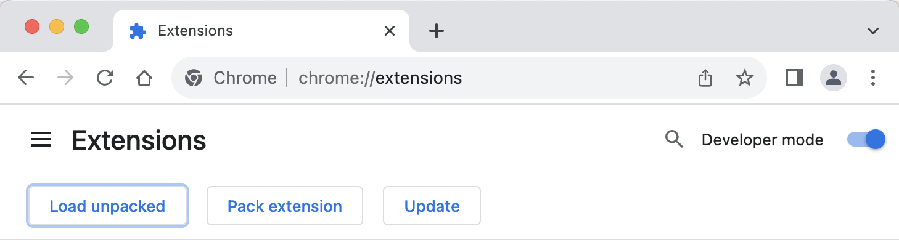

#  Higlighter Chrome V2

My Chrome Extension

## Features

- Feature 1
- Feature 2

## Install

[**Chrome** extensions](chrome://extensions/)

## Setup

### Local Development

```
git clone [this repo]
cd [this repo dir]
npm run deps
npm run watch
```

This should get you started developing, it will create a `build`
directory that you can load into your browser as an extension if you turn on
extensions developer mode.



See also [Mozilla: Your First Extension](https://developer.mozilla.org/en-US/docs/Mozilla/Add-ons/WebExtensions/Your_first_WebExtension)
and [Chrome: Getting Started Tutorial](https://developers.chrome.com/extensions/getstarted) for information
about developing extensions.

## Contribution

Suggestions and pull requests are welcomed!.

---

This project was bootstrapped with [Chrome Extension CLI](https://github.com/dutiyesh/chrome-extension-cli)

